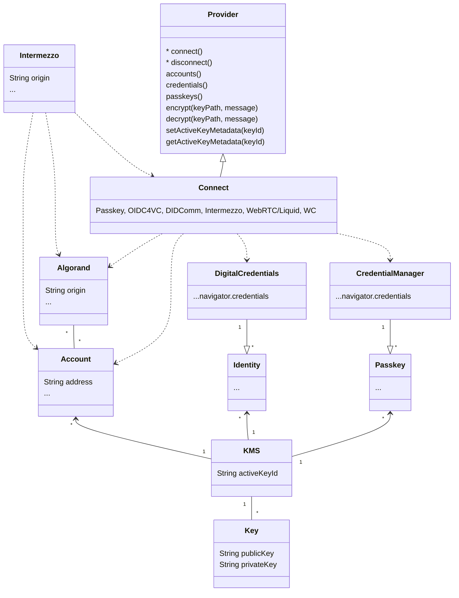

## New Wallet
needs an address on algorand with the ability to sign transactions.

- Local keys are used for identity and|or auth purposes such as creating passkeys or signing.
- Accounts can be delegated to a custodian such as Intermezzo. (Allows for a manager of the account).
- Fees can be delegated to a provider when required (TBD)

### Possible Links for Intermezzo/Providers

// Onboarding a new intermezzo managed account, delegate would represent a custodial wallet.
// The local keys would not be funded, but would be able to sign in a chain of trust.
rocca://intermezzo.algorand.co/onboard/<appId>?liquid=true&network=mainnet&delegate=true&manager=<PubKey>

// Onboarding a self-custodial wallet
rocca://intermezzo.algorand.co/onboard/<appId>?network=mainent&fees=true&address=<...>
- Unmanaged by the custodian, with the option to cover fees.

// For requests coming from third parties. (ie dApps)
liquid://intermezzo.algorand.co?requestId=<...>


### Categories of Providers:

1. Algorand/Decentralized, these are the most common providers. (Algod, Indexer, KMD?)
   1. These providers are widely available for self-hosting with the most prominent provider being Nodely.
2. Enterprise/Centralized, these are the providers that are managed by a trusted third party. (KMS like Intermezzo)
   1. Intermezzo acts as a KMS for Algorand.





## Concrete Abstraction

This class could be used to compose different providers that support different features.
This allows for wallets to share a collection of extensions (such as liquid auth, intermizzo accounts, etc)
A wallet provider could then incrementally adopt features without causing downstream effects such as refactoring cycles

```typescript
export enum ProviderId {
    BIATEC = 'biatec',
    DEFLY = 'defly',
    DEFLY_WEB = 'defly-web',
    CUSTOM = 'custom',
    EXODUS = 'exodus',
    KIBISIS = 'kibisis',
    KMD = 'kmd',
    LUTE = 'lute',
    MAGIC = 'magic',
    MNEMONIC = 'mnemonic',
    PERA = 'pera',
    WALLETCONNECT = 'walletconnect',
    WEB3AUTH = 'web3auth',
    W3_WALLET = 'w3-wallet'
}

//TODO: export type Extension<T, V> = (provider: Provider, options: T) => V
export type Extension = (provider: Provider, options: any) => any

/**
 * Represents a base class for managing configurations and extensions dynamically.
 * The class provides functionality to merge options, extend defaults, and add custom extensions.
 *
 * Object that can hold state in a more composed way, allowing for more than just wallet effects
 * Inspired by the work of OctoKit and TxnLab Use Wallet
 */
export class Provider {
    id: ProviderId;
    options: any;

    // Used to inject dependencies and|or check cross-dependencies between extensions
    // These can be independent packages consumed by the public or provided by third parties such as Pera
    static EXTENSIONS: Extension[] = [
        // Use Wallet Becomes a "Type of Provider" for any wallet that handles accounts
        function WithWalletAccounts(provider: Provider, options: any) {
            return {
                accounts: options.accounts || [],
                activeAccount: options.activeAccount || null,
                managerStatus: options.managerStatus || null,
            }
        },
        // Getting access to the indexer or algod could be optional
        function WithAlgorand(provider, options){
            return {
                indexer: options.indexer || null,
                algod: options.algod || null,
            }
        },
        // Adding in passkeys becomes an extension of the Provider, allowing any wallet to support passkeys by becoming a Provider Extension
        function WithPasskeys(provider: Provider, options: any) {
            return {
                passkeys: options.passkeys || [],
                activePasskey: options.activePasskey || null,
            }
        },
        // Adding extra functionality like Intermezzo, Liquid, and OIDC4VC becomes an extension of the Provider
        function WithIntermezzo(provider: Provider, options: any) {
            return {
                intermezzo: options.intermezzo || false, // Would provide the API access information
                liquid: options.liquid || {/* Default Liquid Auth Options*/}, // Other extensions could be loaded by default
                // Manager operations could be included that have access to this.accounts
            }
        },
        // Adding in XHD
        function WithXHD(provider, options){
            return {
                // TODO: these should be interfaces to the library with the key paths and type of operation
                encrypt: options.encrypt || null,
                decrypt: options.decrypt || null,
            }
        }
    ];

    // TBD: Defaults for the Provider
    static DEFAULTS = {};

    /**
     * Constructs a new instance of the class with the provided options.
     * It merges the default options with the supplied options and applies
     * any extensions defined in the class to the current instance.
     *
     * @param id {ProviderId} - The unique identifier for the provider.
     * @param {object} [options] - Optional configuration options to customize the instance and extensions.
     *                              These options are merged with the default settings.
     */
    constructor(id: ProviderId, options?: any) {
        this.id = id;
        this.options = {
            ...(this.constructor as typeof Provider).DEFAULTS,
            ...options,
        };

        // if (this.options.something) {
            // TODO: extra options handling if necessary
        // }

        // Apply extensions to the current instance
        (this.constructor as typeof Provider).EXTENSIONS.forEach((ext: Extension) => {
            Object.assign(this, ext(this, this.options));
        });

    }

    /**
     * Creates and returns a new class that extends the current class, augmenting it with additional extensions.
     *
     * @param {Extension[]} extensions - An array of extensions to be added to the class. Extensions already present will be ignored.
     */
    static withExtensions(extensions: Extension[]): typeof Provider {
        const currentExtensions = this.EXTENSIONS;
        return class extends this {
            static EXTENSIONS = currentExtensions.concat(extensions.filter(ext => !currentExtensions.includes(ext)));
            constructor(options: any) {
                super(options)
            }
        }
    }
}
```